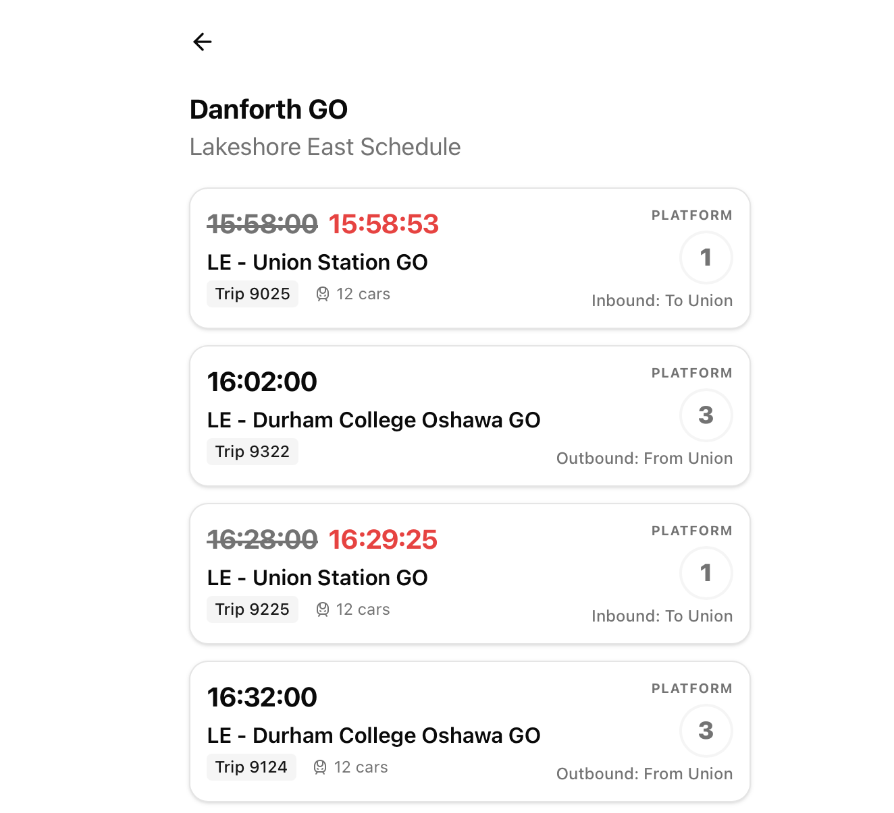

# SmartGO

Never miss your train again!

This is a monorepo for the following projects:

1. [smartGO-api](https://github.com/eilayk/smartgo/tree/main/smartGO-api) - an API for GO Metrolinx trains that shows up to date train route information with departure times, platform, and train length
2. [gtfs-to-sqlite](https://github.com/eilayk/smartgo/tree/main/gtfs-to-sqlite) - a script that generates an sqlite database from Metrolinx GO GTFS data

## Related

- [smartgo-ui](https://github.com/eilayk/smartgo-ui), a Next.JS app that consumes the smartgo-api.
- [smartgo-app](https://github.com/eilayk/smartgo-app), a React Native application that consumes smartgo-api.
